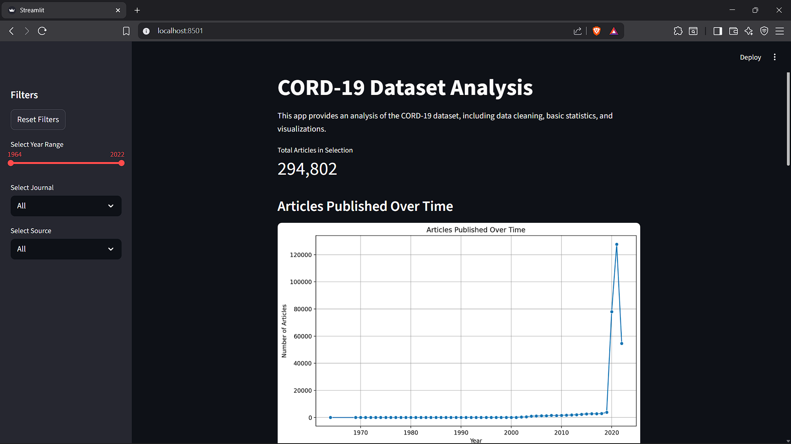

# 📊 CORD-19 Research Dashboard

An interactive Streamlit web application for exploring the **COVID-19 Open Research Dataset (CORD-19)**. This dashboard allows users to dynamically filter and visualize over a million scholarly articles to uncover trends in COVID-19 research.

*
*(Replace this with a real screenshot of your app in the repo root)*

---

## ✨ Features

*   **Interactive Filtering:** Filter the entire dataset by publication year, journal name, and data source.
*   **Dynamic Visualizations:** All charts and metrics update instantly based on your selections.
*   **Efficient Caching:** Uses Streamlit's caching to load the 1.6 GB dataset only once, ensuring smooth interaction after the initial startup.
*   **Insightful Analytics:** Uncover publication trends, identify top journals, and explore common research themes.

## 📈 Visualizations Included

*   **Articles Published Over Time:** A line chart showing the explosion of research year by year.
*   **Top 10 Journals:** A horizontal bar chart identifying the most prolific journals.
*   **Word Cloud of Titles:** A word cloud highlighting the most frequent terms in article titles.
*   **Distribution by Source:** A bar chart showing the breakdown of articles by their source aggregator.

---

## 🚀 Getting Started

Follow these steps to set up and run the project locally.

### 1. Prerequisites

*   Python 3.8+
*   Microsoft Visual Studio Code (optional but recommended), Jupyter Notebook or JupyterLab (to run the notebook).

### 2. Clone the Repository

```bash
git clone <your-repository-url>
cd <repository-folder>
```

### 3. Install Dependencies

```bash
pip install -r requirements.txt
```

### 4. ⚒️ Data Setup

⚠️ The `data/` folder is **excluded from GitHub** to keep the repository lightweight.  
You need to create it manually and download the dataset:

1. **Create a 'data/' folder** in the project root.
2. **Download the CORD-19 Dataset:** Locate and download the raw metadata.csv archive file from https://www.kaggle.com/datasets/allen-institute-for-ai/CORD-19-research-challenge.
3. **Extract and Place the File:** Create a data/ folder in the project root. Extract the downloaded archive and place metadata.csv inside. 
4. **Run the Notebook file:** Open and run the Jupyter Notebook (CORD-19_Analysis.ipynb). This will process the raw data and save cleaned_metadata.csv into the data/ folder.

Your project structure should look like this:

```bash
your-project/
├── data/
│ ├── metadata.csv (original raw data)
│ └── cleaned_metadata.csv (generated by the notebook)
├── main.py
├── notebooks/
│   └── CORD-19_Analysis.ipynb
├── requirements.txt
└── screenshot.png
```
### 5. Run the Streamlit App

You're all set! Launch the dashboard with the following command from the root folder of your project:

```bash
streamlit run main.py
```
## 📜 License
This project is licensed under the MIT License. Feel free to use and adapt it.

## 🤝 Contributing
Contributions, issues, and feature requests are welcome! Please open an issue or pull request.
